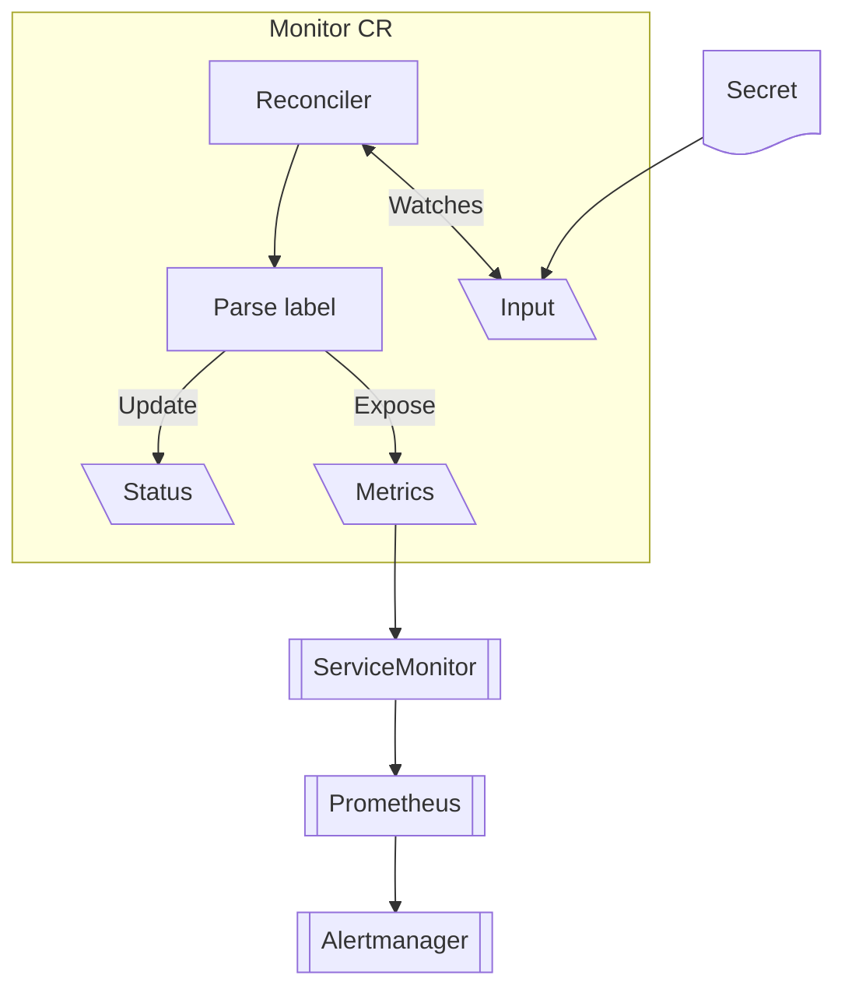

# Expiring Secrets Operator

A Kubernetes operator that monitors expiring credentials in Secrets and provides alerting through Prometheus metrics.

## Overview

Many organizations use Personal Access Tokens (PATs), API keys, and other credentials that have expiration dates. When these expire without notice, it can lead to CI/CD pipeline failures, deployment issues, and downtime.

This operator watches Kubernetes Secrets containing expiring credentials and:

- ✅ Exposes **Prometheus metrics** for monitoring expiration times
- 📊 Updates **CR status** with human-readable state information  
- 🚨 Supports **configurable alert thresholds** (Info, Warning, Critical)
- 🔄 Works with **External Secrets Operator** and other secret management tools
- 🏢 Follows **OpenShift operator best practices**

## Quick Start

### 1. Deploy the Operator

```bash
# Build and deploy to local Kind cluster
make deploy-core

# Or build Docker image
make docker-build
```

### 2. Create a Secret with Expiration Label

```yaml
apiVersion: v1
kind: Secret
metadata:
  name: docker-registry-token
  labels:
    expiringsecret.stakater.com/validUntil: "2026-03-15"  # YYYY-MM-DD format
data:
  token: <base64-encoded-token>
```

### 3. Create a Monitor Resource

```yaml
apiVersion: expiring-secrets.stakater.com/v1alpha1
kind: Monitor
metadata:
  name: docker-registry-monitor
spec:
  service: docker.io
  secretRef:
    name: docker-registry-token
    namespace: default
  alertThresholds:
    infoDays: 30      # Start showing "Info" state 30 days before expiration
    warningDays: 14   # "Warning" state 14 days before  
    criticalDays: 7   # "Critical" state 7 days before
```

### 4. Check Status

```bash
kubectl get monitor docker-registry-monitor -o wide
# NAME                     REGISTRY   SECRET                 STATE   EXPIRES AT             AGE
# docker-registry-monitor  docker.io  docker-registry-token  Info    2026-03-15T00:00:00Z   1m
```

## Prometheus Metrics

The operator exposes these metrics on `/metrics`:

```prometheus
# Absolute expiration timestamp (Unix time)
secretmonitor_valid_until_timestamp{registry="docker.io",name="docker-registry-monitor",namespace="default"} 1760486400

# Human-friendly seconds until expiry
secretmonitor_seconds_until_expiry{registry="docker.io",name="docker-registry-monitor",namespace="default"} 1209600

# Reconciliation success/failure counter
secretmonitor_reconcile_total{monitor="docker-registry-monitor",namespace="default",result="success"} 5
```

## Alert States

| State | Description | Default Threshold |
| ----- | ----------- | ----------------- |
| **Valid** | Secret is healthy and far from expiration | > 30 days |
| **Info** | Secret approaching expiration but not urgent | 14-30 days |
| **Warning** | Secret needs attention soon | 7-14 days |
| **Critical** | Secret expires very soon - action required | < 7 days |
| **Expired** | Secret has already expired | Past expiration date |
| **Error** | Cannot determine state (missing secret, invalid format, etc.) | N/A |

## PrometheusRule Example

```yaml
apiVersion: monitoring.coreos.com/v1
kind: PrometheusRule
metadata:
  name: expiring-secrets-alerts
spec:
  groups:
  - name: expiring-secrets
    rules:
    - alert: SecretExpiringSoon
      expr: secretmonitor_seconds_until_expiry < 14 * 24 * 60 * 60  # 14 days
      for: 1h
      labels:
        severity: warning
      annotations:
        summary: "Secret {{ $labels.name }} expires in {{ $value | humanizeDuration }}"
    
    - alert: SecretExpiredCritical  
      expr: secretmonitor_seconds_until_expiry < 7 * 24 * 60 * 60   # 7 days
      for: 30m
      labels:
        severity: critical
      annotations:
        summary: "Secret {{ $labels.name }} expires VERY SOON: {{ $value | humanizeDuration }}"
```

## Use Cases

- **Container Registry PATs**: Docker Hub, Quay.io, GitHub Packages tokens
- **CI/CD Pipeline Tokens**: GitHub Actions, GitLab CI, Jenkins credentials  
- **API Keys**: Third-party service credentials with expiration dates
- **Certificates**: TLS certs, signing certificates (when stored as secrets)
- **Database Passwords**: Auto-rotated credentials from secret management systems

## Development

```bash
# Run tests (includes controller unit tests)
make test

# Run end-to-end tests
make test-e2e

# Generate CRD manifests
make manifests

# Format and vet code
make fmt vet
```

## Architecture



## Requirements

- Kubernetes 1.25+
- Secrets must have `expiringsecret.stakater.com/validUntil` label in `YYYY-MM-DD` format
- Prometheus operator (for ServiceMonitor/PrometheusRule)

## License

Apache License 2.0
